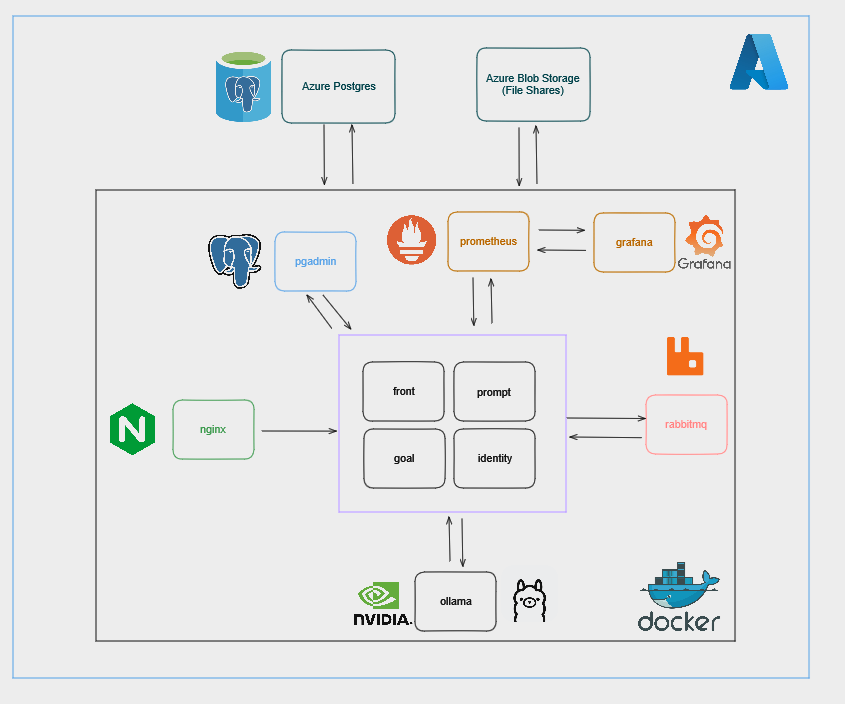
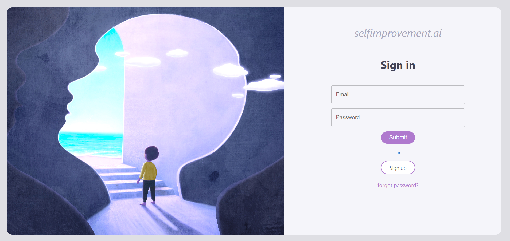
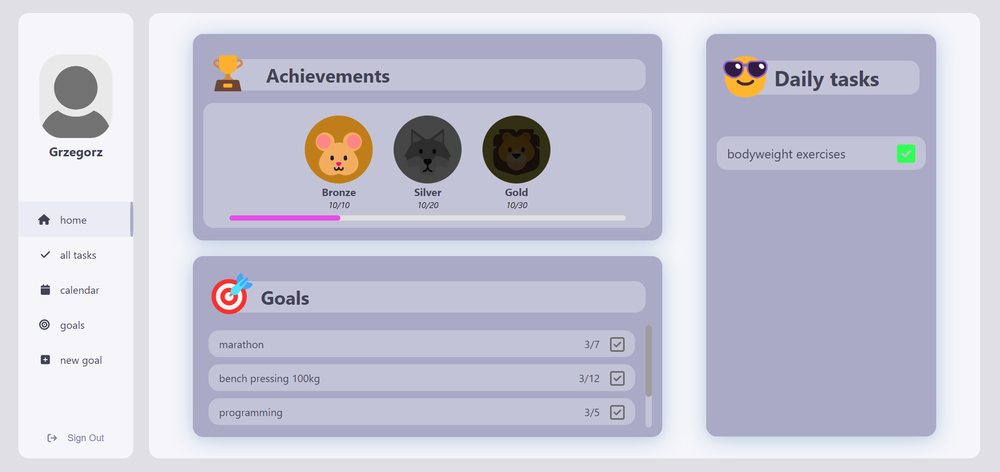
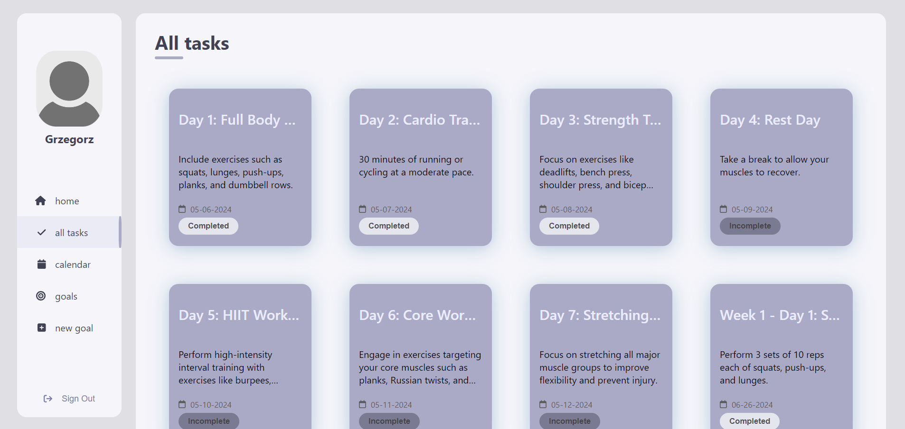

# selfimprovement.ai
Masters Degree project for Polish Japanese Institute of Technology in Warsaw.  

# Topic
Application for self-improvement that uses various AI tools and API's.  
We strive to provide personal AI assistant that will help user to schedule his/her tasks and create personal plans.  

# Team members:
### Adam Bączkowski (DevOps)  
##### * Creating Pipelines
##### * Writing Dockerfiles and docker compose
##### * Terraform infrastructure management
##### * Creating scripts
##### * Monitoring
##### * API management
##### * Prompt Engineering
##### * Secrets Management
##### * Database management
##### * Documentation and README files management
##### * Creating benchmarks for LLMs
### Mateusz Młodochowski (Backend)
##### * Creating .Net containers and sevices
##### * API management
##### * Writing Dockerfiles and docker compose
##### * Prompt Engineering
##### * Database management
##### * Creating benchmarks for LLMs
##### * RabbitMq management
### Grzegorz Święcicki (Frontend)
##### * Creating frontend
##### * UX/UI
##### * API management
##### * Prompt Engineering
##### * LateX file moderation
# Tech Stack
C# , React, Typescript, Powershell, Docker, LLAMA2, Kubernetes, Terraform

### Build app localy with docker compose:
You will need to create your own .env file matching variables names in docker-compose-local.yml
```
docker compose --env-file .env -f docker-compose-local.yml up --build
```

### System overview:


### Login screen:


### Home page:


### All tasks page:


### Calendar page:


### Goals page:


### Goal page:


### New goal page:
